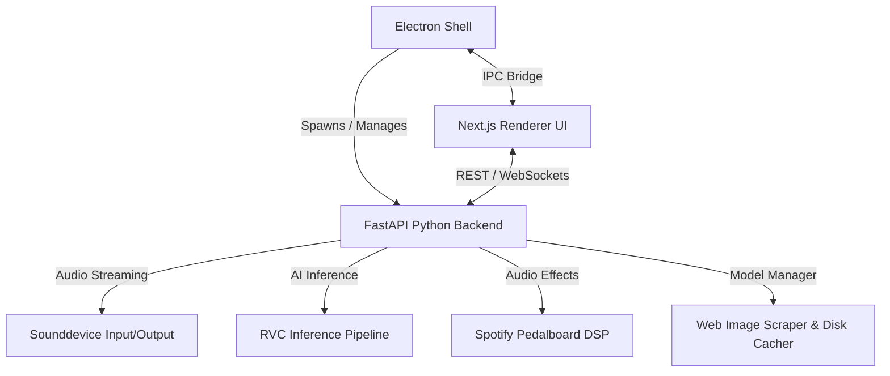

<div align="center">
  

  # RVC Voicechanger

  <p align="center">
    <a href="https://www.electronjs.org/"></a>
    <a href="https://fastapi.tiangolo.com/"></a>
    <a href="https://nextjs.org/"></a>
    <a href="https://pytorch.org/"></a>
    
  </p>

  <p align="center">
    <strong>A premium, real-time AI voice changer desktop application powered by Retrieval-based Voice Conversion (RVC) and Pedalboard DSP.</strong><br />
    Experience near-zero latency conversion, automated image scraping for models, and customizable preset controls in a beautiful glassmorphic dark-mode interface.
  </p>
</div>

---

## 🌟 Key Features

*   **Real-time AI Voice Conversion:** Highly optimized local RVC pipeline utilizing PyTorch, ONNX, and torchfcpe for pitch extraction.
*   **Integrated DSP Pedalboard:** Embedded real-time noise gate, highpass filter, compressor, pitch shifter, and reverb powered by Spotify's `pedalboard` library.
*   **Automatic Web Image Scraper:** Automatically scans `.pth` and `.index` model names to scrape, cache, and display high-quality model avatars from DuckDuckGo and Wikipedia.
*   **One-Click RVC Import:** Seamlessly import custom Applio voice models via a drag-and-drop local import interface.
*   **Compact Model Manager:** Star your favorite models or delete custom presets directly from the grid.
*   **Clean Mode Bypass:** Select the **Original** voice to bypass the DSP chain entirely and route your clean microphone audio directly.
*   **Low Latency & High Performance:** Tailored multi-threaded pipeline with macOS OpenMP conflict mitigation for smooth performance on Apple Silicon.

---

## 📸 Screenshots

*Screenshots will be added here.*

---

## 🏗️ Architecture & Workflow

The application runs a hybrid desktop architecture: a modern React frontend hosted locally by a Python FastAPI server, all orchestrated within an Electron shell.



---

## 🛠️ Technology Stack

*   **Frontend Shell:** [Electron](https://www.electronjs.org/), JavaScript
*   **User Interface:** React, [Next.js](https://nextjs.org/), Tailwind CSS, Lucide Icons, Shadcn UI
*   **Backend Server:** [FastAPI](https://fastapi.tiangolo.com/), Uvicorn, WebSockets
*   **Audio Engine:** PySoundDevice, Spotify Pedalboard, PyTorch, FAISS, Librosa

---

## 🚀 Getting Started

### Prerequisites

*   **Node.js:** v18.x or later (pnpm recommended)
*   **Python:** v3.10 to v3.12 (with pip and venv)

### Installation

1.  **Clone the Repository:**
    ```bash
    git clone https://github.com/satiricalguru/RVC-Voicechanger.git
    cd rvc-voicechanger
    ```

2.  **Set Up the Python Virtual Environment:**
    ```bash
    python3 -m venv .venv
    source .venv/bin/activate
    pip install -r requirements.txt
    ```

3.  **Install Frontend Dependencies:**
    ```bash
    cd ui
    pnpm install
    cd ..
    ```

4.  **Install Electron Shell Dependencies:**
    ```bash
    pnpm install
    ```

### Running the Application

*   **Development Mode:**
    ```bash
    npm run dev
    ```
    This launches the FastAPI backend locally, boots the hot-reloaded Next.js client, and opens the Electron desktop window.

*   **Production Build & Start:**
    ```bash
    npm start
    ```

### Packaging the Application

Compile the app bundle into a standalone executable (e.g., `.dmg` on macOS, `.exe` on Windows):
```bash
npm run build
```

---

## 📂 Folder Structure

```
.
├── app/                  # FastAPI Backend API
│   ├── backend/          # Models Manager, Engine, and RVC Pipeline
│   └── frontend/         # Static compiled Next.js bundle
├── assets/               # Branding assets & application icons
├── electron/             # Main process & IPC handler definitions
├── ui/                   # Next.js / Tailwind React components
├── models/               # RVC Models folder
│   ├── applio/           # Native pre-installed RVC checkpoints
│   ├── custom/           # User imported .pth / .index files
│   └── images/           # Cached scraped web avatars
├── requirements.txt      # Python dependencies
└── package.json          # Node scripts and Electron configuration
```

---

## 📄 License

This project is licensed under the MIT License - see the [LICENSE](LICENSE) file for details.
